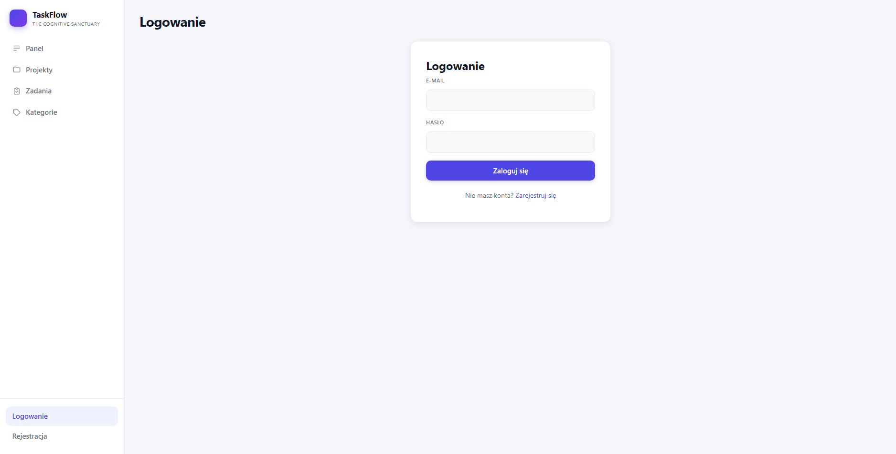
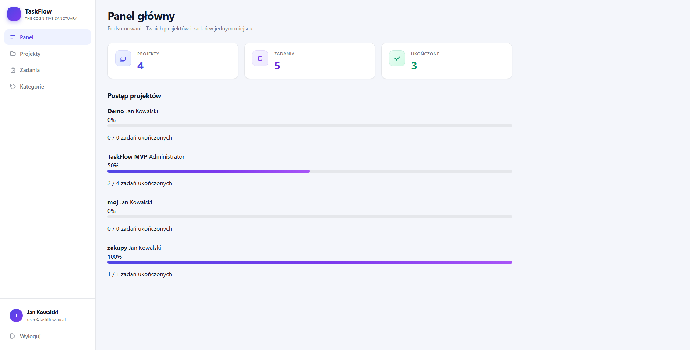
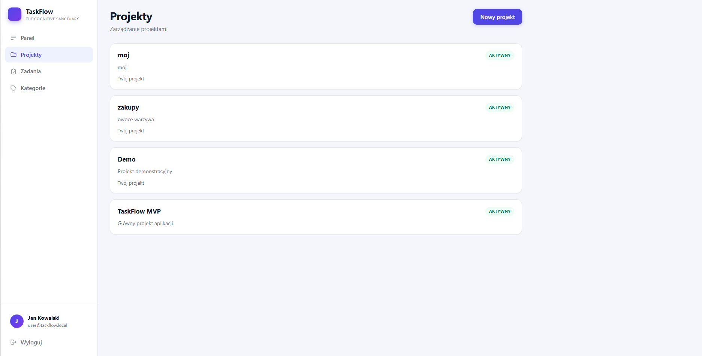
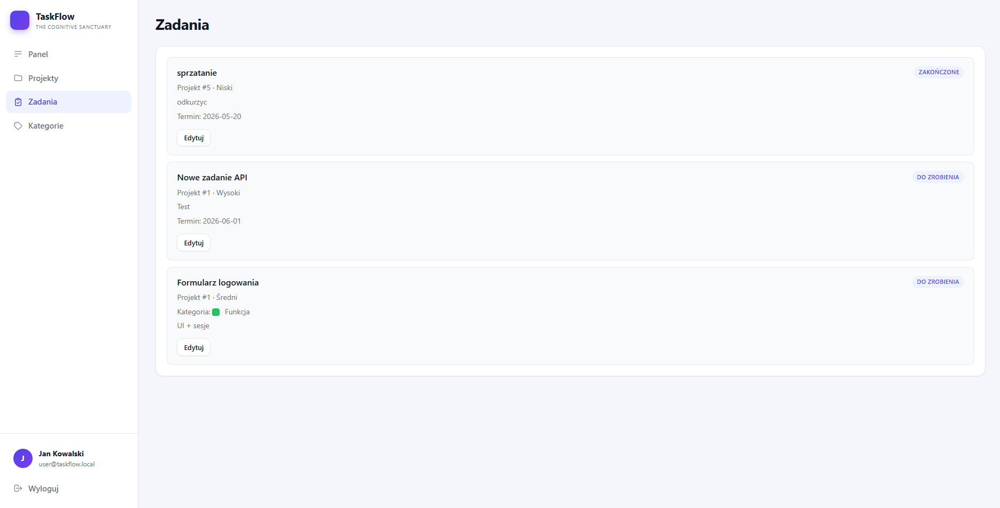
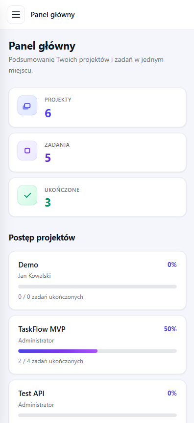

# TaskFlow

**TaskFlow** to aplikacja webowa do zarządzania projektami i zadaniami. Umożliwia pracę zespołową w ramach projektów, śledzenie statusów zadań, kategoryzację oraz podgląd postępu na panelu głównym. Projekt powstał w ramach zajęć — implementacja w **PHP 8.2 (OOP)**, architektura **MVC**, baza **PostgreSQL**, uruchomienie w **Docker Compose**, interfejs w **HTML5 / CSS / JavaScript (Fetch API)**.

**Autor:** Mateusz Więcek

---

## 1. Opis projektu

TaskFlow łączy panel administracyjny z codzienną pracą użytkownika: logowanie oparte o sesję, widoki HTML renderowane po stronie serwera oraz operacje CRUD wykonywane asynchronicznie przez REST API (`/api/...`) z poziomu przeglądarki. Aplikacja **nie korzysta z frameworków** PHP ani JS (brak Laravel, Symfony, React, Vue, Bootstrap itd.) — routing, warstwa HTTP, repozytoria i serwisy są zaimplementowane ręcznie.

Główne obszary systemu:

- **Uwierzytelnianie** — rejestracja (`POST /api/register`, strona `/register`), logowanie, wylogowanie, sesja PHP (bez auto-logowania po rejestracji)
- **Projekty** — tworzenie, edycja, usuwanie (zależnie od roli), statusy: `active`, `on_hold`, `completed`
- **Zadania** — przypisanie do projektu, statusy `todo` / `in_progress` / `done`, priorytety, kategorie, termin
- **Kategorie** — słownik kategorii zadań (zarządzanie przez administratora)
- **Panel główny** — statystyki i postęp projektów (widok SQL `view_project_progress`)
- **Użytkownicy** — lista i zmiana ról/statusu (tylko administrator)

Aplikacja dostępna domyślnie pod adresem: **http://localhost:8080**

---

## 2. Główne funkcjonalności

| Obszar | Opis |
|--------|------|
| **Auth** | `POST /api/register`, `POST /api/login`, `POST /api/logout`, `GET /api/me`, strony `/login`, `/register` (`auth.js`) |
| **Dashboard** | Statystyki projektów/zadań, lista postępu z widoku `view_project_progress` |
| **Projekty** | Lista, formularz tworzenia/edycji, usuwanie; API REST pod `/api/projects`; tworzenie w transakcji PDO (projekt + wpis właściciela w `project_members`) |
| **Zadania** | Lista z filtrami uprawnień, CRUD przez `/api/tasks`; ograniczona edycja dla roli `user` |
| **Kategorie** | CRUD kategorii (`/api/categories`) — mutacje tylko dla `admin` |
| **Użytkownicy** | Panel `/users` i API `/api/users` — wyłącznie `admin` |
| **Błędy** | Strony HTML: 400, 401, 403, 404, 500; API zwraca JSON z komunikatem |
| **Testy** | PHPUnit (serwisy), skrypt `test-endpoints.sh` (integracja API) |

Front-end: responsywny layout (sidebar, widoki Dashboard i Projects w jasnym stylu SaaS). API: **Fetch API** (`TaskFlow.fetchJson` w `app.js`; logowanie i rejestracja w `auth.js`, ładowanym na `/login` i `/register` po `app.js`).

---

## 3. Role użytkowników i uprawnienia

W bazie zdefiniowane są role w tabeli `roles`: `admin`, `project_manager`, `user`. Logika uprawnień znajduje się w `app/Core/Authorization.php` oraz serwisach (`ProjectService`, `TaskService`, `CategoryService`).

### Administrator (`admin`)

- Pełny wgląd we wszystkie projekty i zadania
- Edycja i usuwanie dowolnego projektu
- Pełne zarządzanie zadaniami w każdym projekcie
- Zarządzanie kategoriami (tworzenie, edycja, usuwanie)
- Panel użytkowników (`/users`, `/api/users`)
- Dashboard ze wszystkimi projektami

### Kierownik projektu (`project_manager`)

- Widzi projekty, których jest **właścicielem** (`owner_id`)
- Może edytować i usuwać **tylko własne** projekty
- Zarządza zadaniami w projektach, których jest właścicielem
- Nie ma dostępu do panelu użytkowników ani mutacji kategorii (jak zwykły użytkownik przy kategoriach)

### Użytkownik (`user`)

- Widzi projekty, do których ma dostęp (właściciel lub członek w `project_members`)
- Może **tworzyć** nowe projekty (staje się ich właścicielem)
- **Nie** edytuje ani nie usuwa projektów zarządzanych przez innych (brak `can_edit` / `can_delete` w API)
- Widzi zadania **przypisane do siebie** (`assignee_id`)
- Może **ograniczenie edytować** przypisane zadanie (status, opis) — flaga `can_edit_limited` w API
- Nie usuwa zadań; brak dostępu do `/users` i mutacji kategorii

### Macierz skrócona

| Akcja | admin | project_manager | user |
|-------|:-----:|:---------------:|:----:|
| Lista wszystkich projektów | ✓ | własne | dostępne |
| Edycja/usunięcie projektu | ✓ | własne | — |
| Tworzenie projektu | ✓ | ✓ | ✓ |
| Pełne CRUD zadań | ✓ | w swoich projektach | ograniczona edycja |
| Kategorie (zapis) | ✓ | — | — |
| Panel użytkowników | ✓ | — | — |

---

## 4. Technologie

| Warstwa | Technologia |
|---------|-------------|
| Backend | PHP 8.2+, OOP, PSR-4 (`App\`) |
| Architektura | MVC (własny router, kontrolery, modele, repozytoria, serwisy) |
| Baza danych | PostgreSQL 16 |
| Dostęp do DB | PDO |
| Konteneryzacja | Docker, Docker Compose |
| Serwer WWW | Apache (obraz `php-apache` w `Dockerfile`) |
| Front-end | HTML5, CSS3, JavaScript (ES6+, Fetch API) |
| Testy | PHPUnit 10 |
| Kontrola wersji | Git |
| Zależności PHP | Composer (`composer.json`) |

**Świadomie nieużywane:** Laravel, Symfony, Slim, React, Vue, Angular, Bootstrap, Tailwind, jQuery.

---

## 5. Architektura aplikacji MVC

```
Przeglądarka (HTML + JS Fetch)
        │
        ▼
public/index.php  ──►  App::run()
        │
        ├── Session (autoryzacja)
        ├── Router (dopasowanie URI → kontroler@metoda)
        └── Controller
                ├── Services (reguły biznesowe, uprawnienia)
                ├── Repositories (zapytania SQL / PDO)
                └── Response
                        ├── HTML (views/*.php + layouts)
                        └── JSON (/api/*)
```

**Model** — klasy w `app/Models/` (encje: `User`, `Project`, `Task`, `Category`) oraz warstwa persistence w repozytoriach.

**View** — szablony PHP w `views/` (layout `views/layouts/main.php`, widoki funkcjonalne, strony błędów).

**Controller** — klasy w `app/Controllers/`, cienka warstwa: walidacja wejścia HTTP, wywołanie serwisu, zwrot `Response`.

Przepływ typowego żądania API:

1. `Request::capture()` — metoda, URI, nagłówki, JSON body  
2. Kontroler sprawdza sesję (`requireAuthJson()` / przekierowanie na `/login`)  
3. Serwis stosuje reguły `Authorization` i wywołuje repozytorium  
4. `Response::json()` lub `Response::html()` + `ErrorHandler` przy wyjątkach  

Diagram architektury (Mermaid): [`docs/architecture.md`](docs/architecture.md)  
Opcjonalny eksport PNG: [`docs/architecture.png`](docs/architecture.png)

---

## 6. Struktura katalogów

```
TaskFlow/
├── app/
│   ├── Controllers/      # Kontrolery MVC (Auth, Dashboard, Project, Task, Category, User)
│   ├── Core/             # App, Router, Request, Response, Database, Session, Authorization, ErrorHandler
│   ├── Middleware/       # RoleMiddleware (np. dostęp admina do /users)
│   ├── Models/           # Encje domenowe
│   ├── Repositories/     # Dostęp do PostgreSQL (PDO)
│   └── Services/         # Logika biznesowa
├── config/
│   └── config.php        # Konfiguracja (odczyt .env / zmiennych środowiskowych)
├── database/
│   ├── init.sql          # Schemat, widoki, funkcje, triggery
│   ├── seed.sql          # Dane testowe
│   └── migrations/       # Migracje inkrementalne
├── docs/                 # Diagramy Mermaid (architecture.md, erd.md), screeny — sekcje 13–14
├── public/
│   ├── index.php         # Front controller
│   ├── .htaccess
│   └── assets/
│       ├── css/style.css
│       └── js/           # app.js, auth.js, dashboard.js, projects.js, tasks.js, …
├── tests/                # PHPUnit — testy serwisów
├── views/
│   ├── layouts/          # main.php, sidebar.php
│   ├── auth/             # login, register
│   ├── dashboard/
│   ├── projects/
│   ├── tasks/
│   ├── categories/
│   ├── users/
│   └── errors/           # 400, 401, 403, 404, 500
├── .env.example
├── composer.json
├── docker-compose.yml
├── Dockerfile
├── phpunit.xml
├── test-endpoints.sh
└── README.md
```

---

## 7. Model bazy danych

### Tabele główne

| Tabela | Opis |
|--------|------|
| `roles` | Role systemowe (`admin`, `project_manager`, `user`) |
| `users` | Konta użytkowników (`role_id` → `roles`) |
| `user_profiles` | Profil 1:1 do użytkownika (display_name, bio, avatar, …) |
| `projects` | Projekty (`owner_id` → `users`, status ENUM) |
| `project_members` | Członkostwo N:M użytkownik ↔ projekt |
| `categories` | Kategorie zadań (nazwa, kolor) |
| `tasks` | Zadania (`project_id`, `assignee_id`, `category_id`, status, priority) |
| `task_status_history` | Historia zmian statusu zadania |
| `activity_logs` | Log aktywności (JSON metadata) |

### Typy ENUM

- `task_status`: `todo`, `in_progress`, `done`
- `task_priority`: `low`, `medium`, `high`
- `project_status`: `active`, `on_hold`, `completed`

### Widoki i funkcje (skrót)

- **`view_project_progress`** — postęp projektów (JOIN `projects` + `users` + agregacja `tasks`)
- **`view_user_task_summary`** — podsumowanie zadań per użytkownik (LEFT JOIN)
- **`calculate_project_progress(project_id)`** — funkcja SQL zwracająca % ukończonych zadań

Diagram ERD (Mermaid): [`docs/erd.md`](docs/erd.md)  
Opcjonalny eksport PNG: [`docs/erd.png`](docs/erd.png)

---

## 8. Baza danych

Aplikacja korzysta z **PostgreSQL**. Schemat i obiekty bazodanowe znajdują się w `database/init.sql` (migracje inkrementalne w `database/migrations/`). Model jest relacyjny: tabele encji, powiązania kluczami obcymi, widoki do raportowania, funkcja i triggery w PL/pgSQL oraz jawna transakcja PDO w warstwie aplikacji przy tworzeniu projektu.

### Relacje

| Typ | Przykład w TaskFlow |
|-----|---------------------|
| **1:1** | `users` ↔ `user_profiles` (`user_id` PK/FK) |
| **1:N** | `users` → `projects` (`owner_id`); `projects` → `tasks` (`project_id`); `categories` → `tasks` |
| **N:M** | `projects` ↔ `users` przez `project_members` (`UNIQUE (project_id, user_id)`) |

### Widoki SQL

- **`view_project_progress`** — postęp projektów: `INNER JOIN` z `users`, `LEFT JOIN` z `tasks`, agregacja `COUNT` z `FILTER`
- **`view_user_task_summary`** — podsumowanie zadań użytkownika: `LEFT JOIN` po `assignee_id`

Widoki są używane m.in. w `DashboardRepository`.

### Funkcja SQL

- **`calculate_project_progress(p_project_id)`** — zwraca procent zadań ze statusem `done` w danym projekcie (`RETURNS NUMERIC`)

### Triggery

- **`update_tasks_updated_at`** — `BEFORE UPDATE ON tasks` ustawia `updated_at`
- **`log_task_status_change`** — `AFTER UPDATE ON tasks` zapisuje zmianę statusu w `task_status_history`

### Transakcje

W triggerach i funkcjach PL/pgSQL operacje są grupowane w blokach `BEGIN … END`.

Przy **`POST /api/projects`** aplikacja wykonuje **jawną transakcję PDO** w `ProjectRepository::create()`:

1. `beginTransaction()`
2. `INSERT` do `projects`
3. `INSERT` właściciela do `project_members` (`ON CONFLICT DO NOTHING`)
4. `commit()` — przy błędzie `rollBack()`

Zachowanie weryfikuje `tests/ProjectRepositoryTest.php`.

### JOIN

Zapytania z **`INNER JOIN`** i **`LEFT JOIN`** występują w widokach (`init.sql`) oraz w repozytoriach (`DashboardRepository`, `TaskRepository`, `ProjectRepository::findAccessibleForUser`).

### Normalizacja (3NF)

Schemat jest zaprojektowany zgodnie z **trzecią postacią normalną (3NF)**:

- Role w osobnej tabeli `roles` (bez powielania nazwy roli przy użytkowniku)
- Profil w `user_profiles` (zależność 1:1 względem `users.id`)
- Kategorie jako słownik; zadania odwołują się przez `category_id`
- Agregaty (np. postęp projektu) liczone w widokach i funkcji, nie trzymane redundantnie w tabelach bazowych

Szczegóły encji i powiązań: [`docs/erd.md`](docs/erd.md).

---

## 9. Instrukcja uruchomienia

### Wymagania

- [Docker](https://www.docker.com/) i Docker Compose (v2)
- Opcjonalnie: Git, Composer (lokalnie; można użyć kontenera `app`)

### Kroki

1. Sklonuj repozytorium i przejdź do katalogu projektu.

2. Skopiuj konfigurację środowiska:

   ```bash
   cp .env.example .env
   ```

   Domyślne wartości są zgodne z `docker-compose.yml` (baza: host `postgres`, port `5432`, baza `taskflow`).

3. Zbuduj i uruchom kontenery:

   ```bash
   docker compose up -d --build
   ```

   Przy **pierwszym** uruchomieniu PostgreSQL wykonuje skrypty z `database/init.sql` i `database/seed.sql` (wolumen `postgres_data`).

4. Zainstaluj zależności PHP (jeśli katalog `vendor/` nie istnieje):

   ```bash
   docker compose run --rm app composer install
   ```

5. Otwórz aplikację: **http://localhost:8080**

### Zatrzymanie

```bash
docker compose down
```

Usunięcie danych bazy (reset):

```bash
docker compose down -v
docker compose up -d --build
```

### Porty

| Usługa | Port na hoście |
|--------|----------------|
| Aplikacja (Apache) | 8080 |
| PostgreSQL | 5432 |

---

## 10. Konta testowe i rejestracja

### Konta z seeda (`database/seed.sql`)

Hasła są zahashowane (bcrypt, `password_verify` w PHP):

| E-mail | Hasło | Rola w systemie |
|--------|-------|-----------------|
| `admin@taskflow.local` | `admin123` | `admin` |
| `pm@taskflow.local` | `pm123` | `project_manager` |
| `user@taskflow.local` | `user123` | `user` |

Dane demonstracyjne po seedzie:

- **Projekty:** TaskFlow MVP, Website Redesign, Mobile App Launch, Documentation Update (właściciele: admin / PM; user jako członek i assignee zadań)
- **Kategorie:** Development, Bug, Design, Documentation
- **Zadania (przykłady):** Implementacja logowania, Panel projektów, Widok zadań, Testy endpointów, Dokumentacja README, Poprawa responsywności
- **Profile:** `user_profiles` dla wszystkich trzech kont seedowych

### Rejestracja nowego użytkownika

- **UI:** http://localhost:8080/register — formularz `#register-form`, skrypt `public/assets/js/auth.js`
- **API:** `POST /api/register` (JSON: `name`, `email`, `password`, `password_confirmation`)
- **Warstwy:** `AuthController::register` → `AuthService::register` → `UserRepository::create`
- Nowe konto zawsze otrzymuje rolę **`user`** (`is_active = true`); pola `role` z żądania są ignorowane
- Hasło: `password_hash()`; walidacja (unikalny e-mail, min. 6 znaków, zgodność haseł) → błąd **400** JSON; sukces **201** JSON
- Po sukcesie: komunikat w UI, przekierowanie na `/login` — **bez** automatycznego logowania
- Rejestracja przez API (np. PowerShell):

```powershell
Invoke-RestMethod -Uri http://localhost:8080/api/register -Method POST `
  -ContentType 'application/json' `
  -Body '{"name":"Jan Test","email":"jan@example.com","password":"haslo123","password_confirmation":"haslo123"}'
```

---

## 11. Testy

### PHPUnit (testy jednostkowe serwisów)

Z kontenera aplikacji:

```bash
docker compose run --rm app composer test
```

Równoważnie:

```bash
docker compose run --rm app ./vendor/bin/phpunit
```

Pliki testów: `tests/AuthServiceTest.php` (logowanie + rejestracja), `ProjectServiceTest.php`, `ProjectRepositoryTest.php` (transakcja przy tworzeniu projektu), `TaskServiceTest.php`, `UserServiceTest.php`.

### Test integracyjny endpointów

Przy działającej aplikacji (`docker compose up -d`):

```bash
docker compose exec app bash test-endpoints.sh
```

Skrypt sprawdza m.in.: `401` bez sesji, `POST /api/register` (201 + duplikat e-mail 400, brak auto-logowania), logowanie admina i usera, `403` dla usera na `/api/users` i `/users`, dostęp admina do chronionych endpointów.

---

## 12. Scenariusz testowy krok po kroku

Poniższy scenariusz można wykonać w przeglądarce (http://localhost:8080) lub częściowo przez API (np. DevTools / curl).

### A. Rejestracja i logowanie

1. Wejdź na `/register`, utwórz konto (unikalny e-mail, hasło min. 6 znaków) — w konsoli `register submit fired`, w Network `POST /api/register`, potem przekierowanie na `/login`.
2. Zaloguj się nowym kontem — rola `user`, brak panelu „Użytkownicy”.
3. Zaloguj się jako **admin** (`admin@taskflow.local` / `admin123`) — dashboard, menu „Użytkownicy”.
4. Wyloguj — powrót do stanu niezalogowanego.
5. Zaloguj się jako **user** (`user@taskflow.local` / `user123`).
6. Zaloguj się jako **project_manager** (`pm@taskflow.local` / `pm123`) — własne projekty (np. Website Redesign, Mobile App Launch).

### B. Role i odmowa dostępu

7. Jako **user** otwórz `/users` — strona **403**.
8. Jako **user** wywołaj `GET /api/users` — **403** JSON.
9. Wywołaj `GET /api/me` bez sesji — **401**.

### C. CRUD projektów

10. Jako **admin** na `/projects` utwórz projekt — `POST /api/projects`; w bazie jednocześnie wpis w `projects` i właściciel w `project_members` (transakcja PDO w `ProjectRepository::create`).
11. Jako **pm** edytuj **Website Redesign** (właściciel PM).
12. Jako **user** sprawdź **TaskFlow MVP** jako członek — bez Edytuj/Usuń u projektu admina.

### D. CRUD zadań

13. `/tasks` jako **admin** — zadania ze wszystkich projektów (seed).
14. Jako **user** — zadania przypisane do Jan Kowalski; edycja statusu/opisu, bez usuwania.
15. Zmiana statusu — wpis w `task_status_history` (trigger).

### E. Kategorie

16. `/categories` jako **admin** — Development, Bug, Design, Documentation.
17. Jako **user** — mutacja kategorii przez API: **403**.

### F. Dashboard

18. `/dashboard` jako **admin** i **user** — statystyki i postęp (zależnie od dostępu do projektów).

### G. Testy automatyczne

19. `docker compose run --rm app composer test` — m.in. rejestracja i transakcja projektu.
20. `docker compose exec app bash test-endpoints.sh` — wszystkie asercje `[PASS]`.

---

## 13. Zrzuty ekranu

Zrzuty znajdują się w katalogu [`docs/screenshots/`](docs/screenshots/).

| Plik | Opis |
|------|------|
| [`login.png`](docs/screenshots/login.png) | Strona logowania |
| [`dashboard-desktop.png`](docs/screenshots/dashboard-desktop.png) | Panel główny — desktop |
| [`projects-desktop.png`](docs/screenshots/projects-desktop.png) | Lista projektów — desktop |
| [`tasks-desktop.png`](docs/screenshots/tasks-desktop.png) | Lista zadań — desktop |
| [`dashboard-mobile.png`](docs/screenshots/dashboard-mobile.png) | Panel główny — mobile |

Dodatkowe (poza minimalnym zestawem):

| Plik | Opis |
|------|------|
| [`projects-mobile.png`](docs/screenshots/projects-mobile.png) | Projekty — mobile |
| [`users-desktop.png`](docs/screenshots/users-desktop.png) | Panel użytkowników (admin) |
| [`categories-desktop.png`](docs/screenshots/categories-desktop.png) | Kategorie — desktop |

### Podgląd











---

## 14. Diagramy

| Plik | Zawartość |
|------|-----------|
| [`docs/architecture.md`](docs/architecture.md) | Architektura MVC (diagram Mermaid: Browser → index.php → Router → Controller → Service → Repository → PostgreSQL; HTML + JSON) |
| [`docs/erd.md`](docs/erd.md) | Diagram ERD bazy danych (Mermaid, zgodny z `database/init.sql`) |
| [`docs/architecture.png`](docs/architecture.png) | Opcjonalny eksport diagramu architektury |
| [`docs/erd.png`](docs/erd.png) | Opcjonalny eksport diagramu ERD |

Diagramy w formacie Mermaid renderują się na GitHubie, GitLabie i w podglądzie Markdown w IDE. Eksport do PNG (`docs/architecture.png`, `docs/erd.png`) można wygenerować z podglądu Mermaid.

---

## Autor

**Mateusz Więcek**

---

## Licencja

Projekt udostępniony na licencji **MIT** (patrz `composer.json`).
