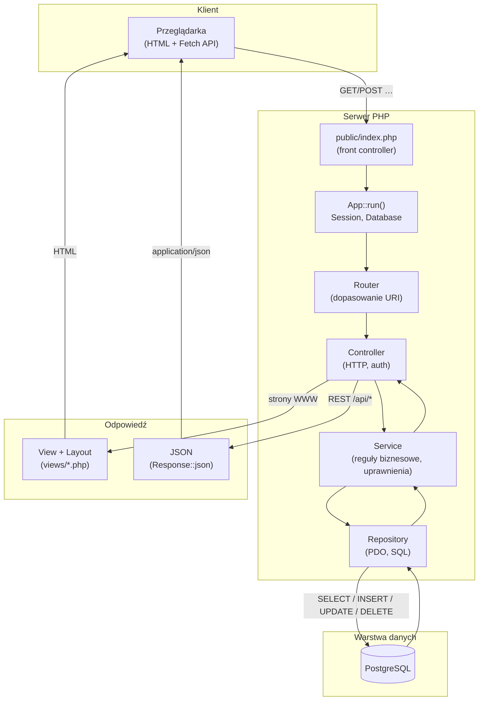

# Architektura TaskFlow (MVC)

TaskFlow to aplikacja **MVC bez frameworków**: żądanie HTTP trafia do `public/index.php`, router wybiera kontroler, kontroler deleguje logikę do serwisu, serwis korzysta z repozytorium (PDO), a odpowiedź wraca jako **HTML** (widoki + layout) lub **JSON** (endpointy `/api/*`).

## Diagram przepływu

## Warstwy

| Warstwa | Lokalizacja | Odpowiedzialność |
|---------|-------------|------------------|
| **Wejście** | `public/index.php`, `app/Core/App.php` | Bootstrap, sesja, połączenie z bazą |
| **Routing** | `app/Core/Router.php` | Mapowanie ścieżki na `Controller@metoda` |
| **Kontroler** | `app/Controllers/` | Autoryzacja żądania, wywołanie serwisu, wybór formatu odpowiedzi |
| **Serwis** | `app/Services/` | Walidacja, uprawnienia (`Authorization`), orchestracja |
| **Repozytorium** | `app/Repositories/` | Zapytania SQL, mapowanie na modele |
| **Model** | `app/Models/` | Encje domenowe (`toArray`, `fromArray`) |
| **Widok** | `views/`, `views/layouts/` | Szablony PHP dla UI |
| **API** | Kontrolery + `Response::json()` | Te same serwisy/repozytoria, inny format wyjścia |

## Przykłady tras

| Typ | Przykład URI | Wynik |
|-----|----------------|-------|
| HTML | `/dashboard`, `/projects` | `view('dashboard.index')` w layoutcie `main.php` |
| API | `GET /api/projects`, `POST /api/tasks` | JSON z danymi lub komunikatem błędu |
| Błędy | nieistniejąca strona / brak uprawnień | `views/errors/404.php`, `403.php` lub JSON 4xx |

## Powiązane pliki

- Routing: `app/Core/App.php` (`registerRoutes`)
- Obsługa wyjątków: `app/Core/ErrorHandler.php`
- Front-end API: `public/assets/js/app.js` (`TaskFlow.fetchJson`)
