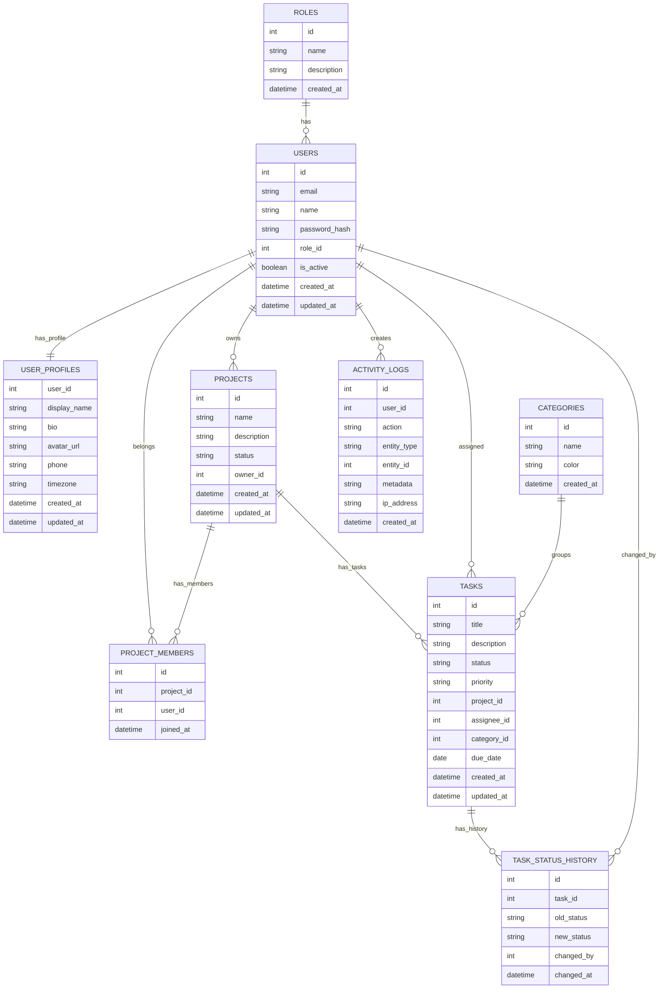

# Diagram ERD — TaskFlow

Schemat odpowiada plikowi [`database/init.sql`](../database/init.sql). Typy ENUM (`task_status`, `task_priority`, `project_status`) są atrybutami kolumn w tabelach `tasks` i `projects`.

## Diagram encji-relacji

## Relacje (skrót)

| Relacja | Opis | Implementacja |
|---------|------|----------------|
| **roles 1:N users** | Każdy użytkownik ma jedną rolę systemową | `users.role_id → roles.id` |
| **users 1:1 user_profiles** | Opcjonalny profil rozszerzony | `user_profiles.user_id` PK/FK → `users.id` |
| **users 1:N projects** | Właściciel projektu | `projects.owner_id → users.id` |
| **users N:M projects** | Członkostwo w projekcie | Tabela łącząca `project_members` (`UNIQUE (project_id, user_id)`) |
| **projects 1:N tasks** | Zadania w projekcie | `tasks.project_id → projects.id` |
| **users 1:N tasks** | Osoba przypisana do zadania | `tasks.assignee_id → users.id` (nullable) |
| **categories 1:N tasks** | Kategoria zadania | `tasks.category_id → categories.id` (nullable) |
| **tasks 1:N task_status_history** | Historia zmian statusu | `task_status_history.task_id → tasks.id` |
| **users 1:N activity_logs** | Log aktywności użytkownika | `activity_logs.user_id → users.id` (nullable) |

## Obiekty poza tabelami (init.sql)

| Obiekt | Typ | Opis |
|--------|-----|------|
| `view_project_progress` | VIEW | Postęp projektów (JOIN + agregacja zadań) |
| `view_user_task_summary` | VIEW | Podsumowanie zadań per użytkownik |
| `calculate_project_progress()` | FUNCTION | Procent zadań `done` w projekcie |
| `update_tasks_updated_at` | TRIGGER | Ustawia `tasks.updated_at` przy UPDATE |
| `log_task_status_change` | TRIGGER | Wpis do `task_status_history` przy zmianie statusu |

## Powiązane pliki

- Schemat: [`database/init.sql`](../database/init.sql)
- Dane testowe: [`database/seed.sql`](../database/seed.sql)
- Architektura aplikacji: [`architecture.md`](architecture.md)
